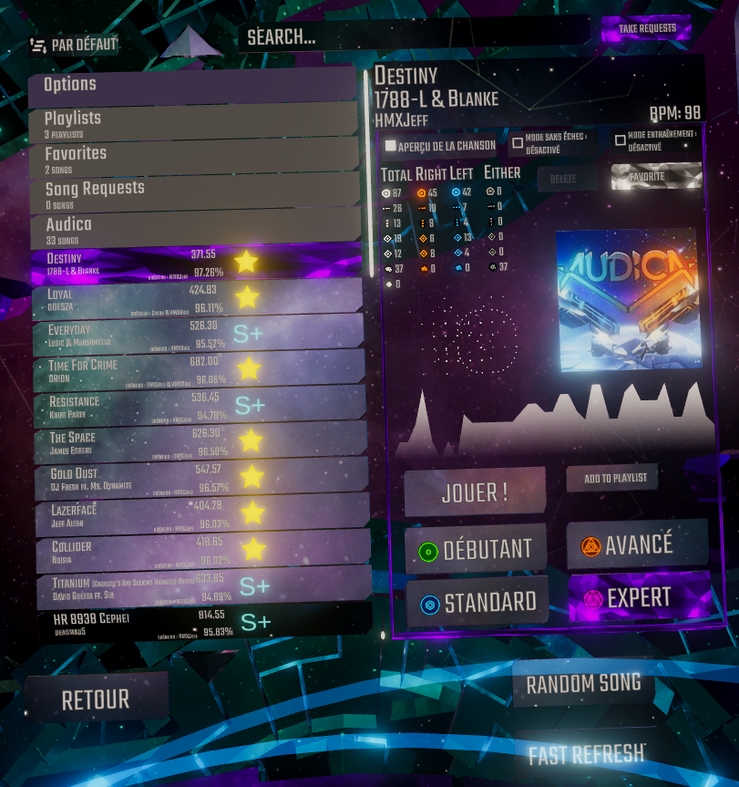
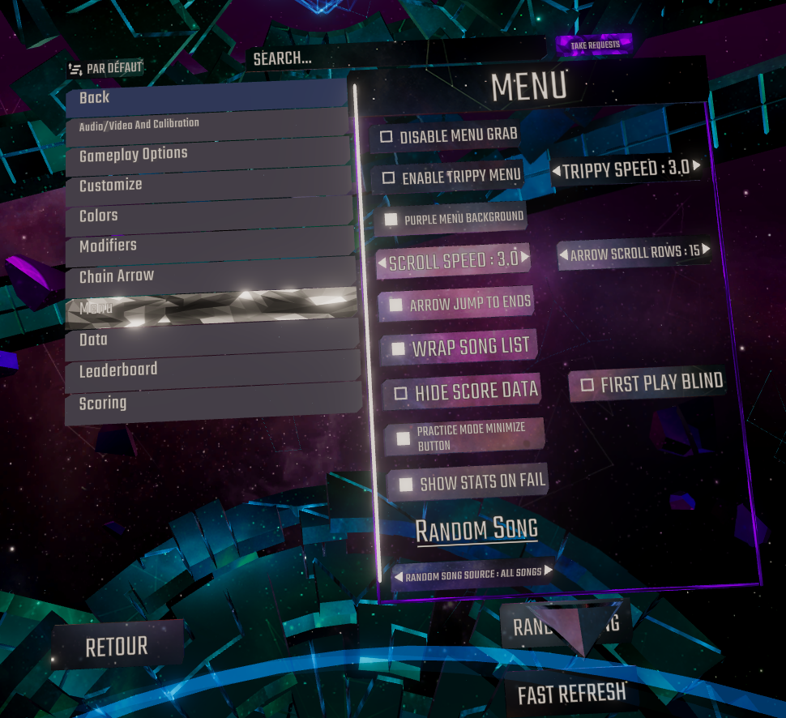

# WARNING
This mod will most likely conflict with these mods.

```
ScorePercentage
SongBrowser
Meeps Audica UI Enhancements
ParticleKiller
MineSoundDisabler
TimingAssist
TemporalAimAssistDisabler
ForcedHitSounds
GunBeamRedirrectionDisabler
TrippyMenu
MenuGrabDisabler
Grind-Mode
ColoredChains
```

Functionality of these mods has been added as options.

## Optional Dependencies
[SongDataLoader](https://github.com/MeepsKitten/Audica-SongDataLoader) (Recommended for full experience) Required to show album art.

[SongRequest](https://github.com/Silzoid/SongRequest) (Requires [TwitchConnectorMod](https://github.com/steglasaurous/twitch-connector-mod)) Full twitch song request support through the folder system.

## EX Scoring
New scoring system scored separately on aim and timing. Uses timing windows and target radius windows for judgement.

## Current implementation
Currently, judgement scoring has been implemented and is the system that is turned on when using EX scoring.

The values are currently in testing, you can browse the current values in Judgement.cs.

## Song list overhaul
This mod includes a massive overhaul of the song list where the launch page is now besides the song list. It now has a folder system. Official songs are now in their own Audica folder as well as DLCs are now in their own Audica DLC folder. Any folder created in the songs folder will show up as a folder on the song list, just like Stepmania, Clone Hero and other rhythm games with custom content.



## Options
Settings are now integrated to the song list. There is a decent amount of customization available from the options menu.



## Thanks
This mod uses code or concepts from other mods and software such as: 

[SongBrowser](https://github.com/Silzoid/SongBrowser) (Song Downloading, Favorite system, Song deliting, Song Search, Fast Refresh, Playlist system, Random song, EitherHand fix, Song Request support)

[NotReaper](https://github.com/octoberU/NotReaper/tree/2021-upgrade) (Target Icons for song data)

[Meeps Audica UI Enhancements](https://github.com/MeepsKitten/Meeps-Audica-UI-Enhancements) (Album Art, Practice Mode menu minimize button)

[ModSettings](https://github.com/octoberU/ModSettings) (Settings menu cloning)

[ParticleKiller](https://github.com/octoberU/ParticleKiller) (Full mod support)

[MineSoundDisabler](https://github.com/MeepsKitten/AudicaMineSoundDisabler) (Full mod support)

[TimingAssist](https://github.com/octoberU/TimingAssist) (Full mod support, "Timing Window" setting)

[TemporalAimAssistDisabler](https://github.com/Alternity156/TemporalAimAssistDisabler) (Full mod support)

[ForcedHitSounds](https://github.com/Alternity156/ForcedHitSounds) (Full mod support)

[GunBeamRedirectionDisabler](https://github.com/Alternity156/GunBeamRedirectionDisabler) (Full mod support)

[TrippyMenu](https://github.com/Alternity156/AudicaTrippyMenu) (Full mod support)

[MenuGrabDisabler](https://github.com/Alternity156/MenuGrabDisabler) (Full mod support)

[Grind-Mode](https://github.com/Contiinuum/Grind-Mode) (GameplayStats on Fail)

[ColoredChains](https://github.com/octoberU/ColoredChains) (Full mod support)

[Simply-Love-SM5](https://github.com/Simply-Love/Simply-Love-SM5) (Timing stats graph)

## AI Disclosure
AI was used in the making of this mod.